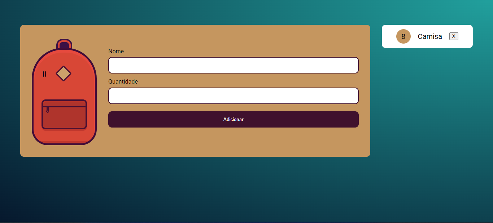
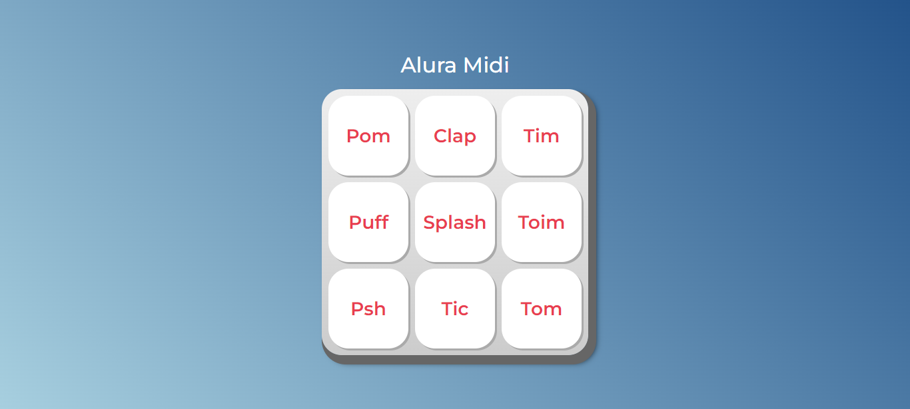

# Repositório de atividades da Alura

Neste respositório consta as minhas atividades desenvolvidas junto aos cursos de programação da Alura.
Nas pastas atuais possuem projetos de Lógica de programação, HTML, CSS e JavaScript.

Alguns desses projetos são:

### HTML e CSS - Portfólio

 

### JavaScript - Mochila de viagem

### JavaScript - Alura Midi

Link do site da Alura: https://www.alura.com.br/
